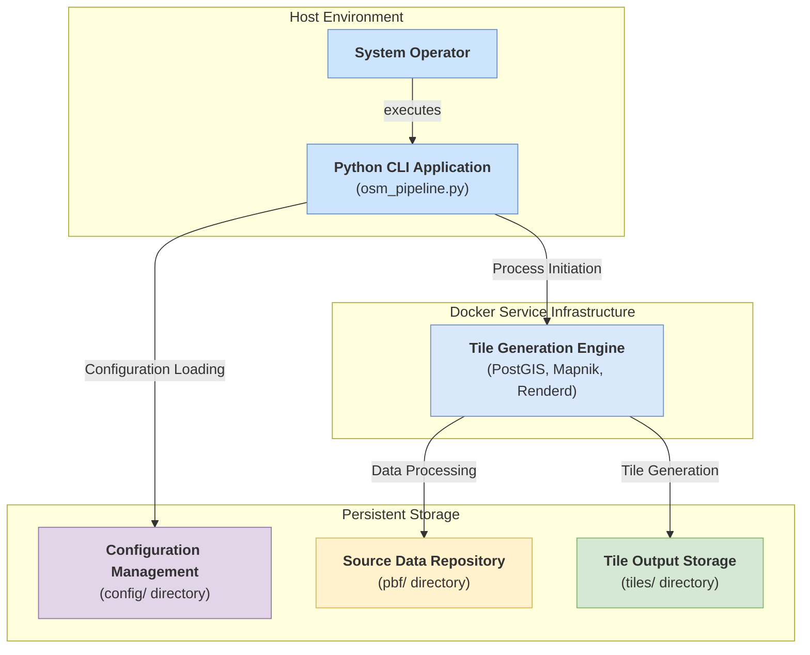

# OSM Tile Generator - Technical Documentation

## 1. System Overview

The OSM Tile Generator is an enterprise-grade, containerized system designed for the automated generation of map tiles from OpenStreetMap data sources in Protocolbuffer Binary Format (`.osm.pbf`). The system implements a modular architecture with comprehensive project management capabilities through an interactive Command Line Interface (CLI) and produces cartographically accurate map tiles utilizing the industry-standard `osm-carto` styling specification. The entire platform is containerized using Docker technology to ensure consistent deployment across heterogeneous computing environments and eliminate dependency-related deployment issues.

### Core System Features:

-   **Containerized Architecture**: All system dependencies including PostgreSQL/PostGIS database, Mapnik rendering engine, and Renderd tile server are encapsulated within Docker containers, ensuring consistent behavior across deployment environments.
-   **Cross-Platform Compatibility**: The system operates uniformly across Windows, macOS, and Linux platforms, requiring only Docker Engine and Python runtime environments.
-   **Interactive Command Interface**: Provides a comprehensive menu-driven interface for project lifecycle management, including creation, configuration, execution, and monitoring of tile generation operations.
-   **Project-Based Configuration Management**: Each tile generation operation is managed as a discrete project with persistent JSON-based configuration storage, enabling efficient reuse of rendering parameters across multiple execution cycles.
-   **Flexible Geographic Scope Definition**: Supports both full dataset processing and geographic bounding box-constrained rendering operations to optimize resource utilization.
-   **Zero-Dependency Python Implementation**: The core application requires no external Python libraries, with all geospatial processing delegated to specialized containerized services.

---

## 2. System Architecture

The system architecture implements a service-oriented design pattern comprised of three primary subsystems: the **Python CLI Application** (Orchestration Layer), **Docker Service Infrastructure** (Processing Layer), and the **File System** (Persistent Storage Layer).

### High-Level Architecture Overview

The following diagram illustrates the primary system components and their architectural relationships:

### System Components:

1.  **Python CLI Application (`osm_pipeline.py`)**:
    -   Primary application entry point providing user interface and system orchestration capabilities
    -   Manages project configuration persistence through JSON-based storage (`config/*.json`)
    -   Initiates and monitors tile generation workflows
    -   Delegates processing operations to containerized services via Docker API

2.  **Docker Service Infrastructure (`docker-compose.yml`)**:
    -   **`osm_postgres`**: PostgreSQL database instance with PostGIS spatial extension, providing geospatial data storage and query capabilities for OSM datasets (geometries, topology, attributes)
    -   **`osm_tools`**: Core processing container utilizing `overv/openstreetmap-tile-server` image, encompassing:
        -   `osm2pgsql`: Standard OSM data import utility for `.pbf` to PostgreSQL/PostGIS data transformation
        -   `renderd`: Mapnik-based tile rendering daemon with request queue management and caching infrastructure
        -   `mod_tile`: Apache HTTP module providing RESTful tile service interface and request routing to `renderd`
    -   **`osm_nginx`**: Nginx reverse proxy server for external tile service exposure and request proxying to internal services

3.  **File System Organization**:
    -   `pbf/`: Source data repository for OpenStreetMap `.osm.pbf` binary datasets
    -   `config/`: Project configuration storage containing JSON-formatted project definitions
    -   `tiles/`: Hierarchical tile storage following standard `{project}/{z}/{x}/{y}.png` directory structure

---

## 3. Operational Workflow: Comprehensive Process Documentation

This section provides a detailed technical analysis of the complete tile generation workflow, from initial system activation through final tile output generation.

### Phase 1: System Initialization and Service Orchestration

The operational cycle commences upon execution of the primary application entry point (`osm_pipeline.py` or platform-specific launcher `osm_pipeline.bat` for Windows environments). This module functions as the **system orchestrator**, managing the entire workflow without direct involvement in geospatial data processing operations.

-   **User Interface Module (`src/ui/menu.py`)**: Upon application launch, the MenuSystem class instantiates an interactive command-line interface, presenting the operator with project management options including new project creation and existing configuration utilization.

### Phase 2: Project Configuration Management

The system supports two distinct operational pathways for project configuration:

**New Project Creation Workflow**:
1. Operator selects "Create new config" from the main menu interface
2. The system prompts for essential project parameters:
   - Unique project identifier (alphanumeric string)
   - Descriptive documentation text
   - Source dataset selection from available `.osm.pbf` files in the `pbf/` directory
   - Rendering scope specification (`full` dataset or geographic `bbox` constraint)
   - Zoom level range definition for tile generation operations
3. **Configuration Manager (`src/config/config_manager.py`)**: Processes collected parameters and generates a persistent JSON configuration file (`{project-name}.json`) within the `config/` directory, establishing the project's operational blueprint.

**Existing Project Utilization Workflow**:
1. Operator selects "Use existing config" from the main menu interface
2. The ConfigManager scans the `config/` directory for available JSON configuration files:
   - `cyprus.json` - Cyprus region project configuration
   - `Kosova.json` - Kosovo region project configuration
3. Operator selects the desired project for execution

Both workflows conclude with the system possessing a complete configuration object containing all parameters necessary for tile generation execution.

### Phase 3: Data Preparation (One-Time Task)

This phase is one of the most important operations performed by Docker in the background and is typically executed only **once** for a `.pbf` file.

1.  **Database Verification**: The `osm-tools` container checks whether the PostGIS database in the `postgres` container has been previously populated for the `.pbf` file to be used.
2.  **Data Transfer (`osm2pgsql`)**: If the database is empty, the `osm2pgsql` tool within `osm-tools` is automatically triggered. `osm2pgsql` reads the `.pbf` file from start to finish, analyzes the roads, buildings, rivers, boundaries, and other geographic elements within it, and transfers them to specialized tables in the PostGIS database. This process prepares the data for map rendering and may take a long time depending on the size of the `.pbf` file.
3.  **Preparation Complete**: Once the data transfer is complete or if the database is already populated, the system is ready for map rendering.

### Phase 4: Core Production Logic - Dynamic Script Generation

This is the most cleverly designed part of the project. The `osm_pipeline.py` script does not directly render maps. Instead, it **creates a temporary and project-specific Python script** that will perform this task.

-   **`src/core/tile_generator.py`**: This module takes the current project configuration (contents of `config.json`).
-   Based on this configuration, it generates a Python code text (string) that will download tiles one by one. This text is a complete Python program containing `for` loops, `curl` commands, and `print` statements for progress tracking.
-   **Why this approach?** Because this way, the main Python application does not depend on complex libraries like `Mapnik` or `PostGIS`. All the heavy lifting is delegated to the `osm-tools` container where these libraries are already installed.

### Phase 5: Tile Production Cycle (Inside Docker)

1.  **Running the Script (`docker exec`)**: `TileGenerator` runs the Python script it just created **inside** the `osm-tools` container using the command `docker exec osm_tools python3 -c "..."`.
2.  **Starting the Loop**: This temporary script running inside the container calculates all the tile coordinates (Z, X, Y) required according to the project configuration and starts a loop.
3.  **HTTP Request (`curl`)**: At each step of the loop, it makes an HTTP request like `curl http://localhost/tile/{z}/{x}/{y}.png` for the next tile. This request is sent to the `Renderd` service running in the same container via Docker's internal network.
4.  **Map Rendering (`Renderd` & `Mapnik`)**: `Renderd` receives this request and passes it to `Mapnik` as a map rendering task. `Mapnik` connects to the `PostGIS` database, retrieves the geographic data for the requested coordinates, combines them with the `osm-carto` style to create a 256x256 pixel PNG image.
5.  **Saving the File**: The generated PNG image is returned to the `curl` command as an HTTP response. `curl` saves this image to the path `/data/tiles/{project-name}/{z}/{x}/{y}.png`.
6.  **Instant Synchronization**: Thanks to the `volumes` definition in the `docker-compose.yml` file (`./tiles:/data/tiles`), every file saved to this path inside the container instantly appears in the `tiles/` folder on your host machine.
7.  The loop continues until all tiles are produced.

### Phase 6: Monitoring and Completion

-   The main `osm_pipeline.py` script listens to the output (`stdout`) of the `docker exec` command in real-time. Every progress message printed by the script running inside the container is immediately displayed in the user's terminal.
-   When the loop completes, the script inside the container ends. `osm_pipeline.py` recognizes that the process has finished, performs a final validation to check for any missing tiles, and notifies the user that the operation has been successfully completed.

---

## 4. Detailed Module Analysis

### `osm_pipeline.py` (Application Entry Point)
-   **Primary Responsibilities**: System initialization, logging configuration, and MenuSystem instantiation
-   **Technical Implementation**: Implements Windows-specific UTF-8 encoding configuration for stdout/stderr streams to ensure cross-platform text handling compatibility
-   **Architecture Pattern**: Follows the facade pattern, providing a simplified interface to the complex modular subsystem

### `src/ui/menu.py` (User Interface Layer)
-   **Primary Responsibilities**: Interactive menu presentation, user input validation, and system component orchestration
-   **Technical Implementation**: Instantiates core system components (TileGenerator, ConfigManager, PBFManager) and coordinates their interactions through a state-driven menu system
-   **Design Pattern**: Implements the mediator pattern for component communication

### `src/config/config_manager.py` (Configuration Management)
-   **Primary Responsibilities**: JSON-based project configuration persistence, validation, and lifecycle management
-   **Technical Implementation**: Utilizes Python's built-in `json` module for serialization/deserialization of project parameters stored as dictionary objects
-   **Data Validation**: Implements schema validation for configuration integrity

### `src/core/tile_generator.py` (Core Processing Engine)
-   **Primary Responsibilities**: Tile generation workflow orchestration and execution monitoring
-   **Critical Functions**:
    1.  `deg2num`: Mathematical coordinate transformation function (WGS84 to tile grid coordinates)
    2.  `estimate_tile_count`: Resource estimation algorithm for tile generation planning
    3.  `_create_simple_tile_script`: **Core Function** - Generates parameterized Python scripts for execution within the `osm-tools` container environment using HTTP-based tile requests via `curl`
    4.  `generate_tiles`: Subprocess management for containerized script execution with real-time output streaming
    5.  `_retry_missing_tiles`: Failure recovery mechanism implementing selective tile regeneration based on validation results

### `docker-compose.yml` (Service Infrastructure Definition)
-   **`osm_postgres`**: PostgreSQL database service utilizing `postgis/postgis:15-3.3` image with persistent storage via `postgres_data` named volume
-   **`osm_tools`**: Primary processing container based on `overv/openstreetmap-tile-server` image:
    -   `depends_on: [postgres]`: Ensures PostgreSQL service initialization precedence
    -   `environment`: Database connection parameters (PGHOST, PGPORT, PGUSER, PGPASSWORD, PGDATABASE)
    -   `volumes`:
        -   `./pbf:/data/pbf:ro`: Read-only mount of host PBF directory to container data path
        -   `./tiles:/data/tiles`: Bidirectional mount for tile output synchronization
        -   `osm_data:/data/database/`: Persistent storage for osm2pgsql cache and renderd working data
    -   `command: run`: Initiates the renderd tile server daemon upon container startup
-   **`osm_nginx`**: Nginx reverse proxy service for external tile service exposure

### `nginx.conf` (Web Server Configuration)
-   **Primary Function**: HTTP request routing and reverse proxy configuration
-   **Route Definition**: `location /tiles/` directive implements reverse proxy mapping from external endpoint `http://localhost:8081/tiles/...` to internal service `http://osm_tools:80/tile/...`
-   **Security Implementation**: Prevents direct external exposure of the osm-tools container while maintaining tile service accessibility

---

## 5. Technical Assessment and Design Conclusions

This system represents an exemplary implementation of enterprise-grade geospatial data processing pipeline abstraction, successfully encapsulating the complex transformation workflow (PBF → PostGIS → Mapnik → PNG Tiles) within a manageable, Docker-orchestrated architecture. The most significant architectural decision involves the implementation of **HTTP-based tile server automation** rather than direct Mapnik library integration, effectively eliminating Python-side dependencies while ensuring maximum system robustness and deployment portability across heterogeneous computing environments.

---

## 6. Core Technology Stack Analysis

This section provides detailed technical specifications for the fundamental technologies integrated within the system architecture and their specific operational roles in the tile generation pipeline.

### Nginx (`osm_nginx` Service)

-   **Technology Overview**: High-performance HTTP server, reverse proxy, load balancer, and HTTP cache engine, powering numerous high-traffic internet applications.
-   **System Integration**: Nginx serves two primary functions within the project architecture:
    1.  **Reverse Proxy Implementation**: Intercepts incoming HTTP requests to `localhost:8081/tiles/...` and forwards them to the internal Docker network endpoint `http://osm_tools:80/tile/...`, providing service abstraction and single-point access control.
    2.  **Static Content Delivery (Future Enhancement)**: Configured for potential direct serving of generated PNG tiles from the `tiles/` directory, currently proxying all requests to the osm-tools container but easily reconfigurable for static file delivery.

### osm2pgsql (Integrated within `osm-tools` Container)

-   **Technology Overview**: Standard OpenStreetMap data import utility specifically engineered for optimized `.pbf` to PostGIS database transformation workflows.
-   **System Integration**: Upon initial `osm-tools` container initialization, osm2pgsql processes the `.osm.pbf` datasets from the `pbf/` directory. The utility performs comprehensive data analysis, extracting cartographically significant feature layers (transportation networks, building footprints, hydrographic features, administrative boundaries) and transforms them into PostGIS-compatible geospatial tables within the PostgreSQL database. This preprocessing stage is essential for subsequent Mapnik rendering operations.

### Mapnik (Integrated within `osm-tools` Container)

-   **Technology Overview**: Industry-standard open-source C++ cartographic rendering library supporting multiple data sources (PostGIS, Shapefile, GeoJSON) with XML and CartoCSS styling specification compliance.
-   **System Integration**: Functions as the **core rendering engine** of the tile generation pipeline. Upon receiving tile requests from the `renderd` service (e.g., "render map tile for zoom level 12 at specified coordinates"), Mapnik executes the following processing sequence:
    1.  Establishes database connectivity to the PostgreSQL/PostGIS instance
    2.  Executes spatial queries to retrieve geographic features within the specified coordinate bounds and zoom level
    3.  Applies predefined `osm-carto` styling rules (as defined in `mapnik_temp.xml` configuration) to the retrieved data, implementing cartographic symbology such as highway classification rendering ("highway=primary" with specific stroke width/color) and natural feature visualization ("natural=water" with blue fill)
    4.  Generates the final 256x256 pixel PNG tile image and returns it to the `renderd` service for delivery

### Renderd & mod_tile (Integrated within `osm-tools` Container)

-   **Technology Overview**: `renderd` implements a comprehensive request queue management system for Mapnik operations, while `mod_tile` provides Apache HTTP server integration, translating standard web requests (`/z/x/y.png`) into renderd-compatible command sequences. The `overv/openstreetmap-tile-server` image provides both components as an integrated solution.
-   **System Integration**: This combined system serves as the **operational control center** for tile server operations:
    -   Incoming `curl` requests from Python scripts are initially processed by the `mod_tile` module
    -   `mod_tile` implements intelligent request prioritization and queue management based on system load and request urgency
    -   `renderd` processes queued requests and issues rendering commands to the Mapnik engine
    -   Advanced caching mechanisms serve previously rendered tiles from cache storage, significantly improving response times and reducing computational overhead

### PostGIS (PostgreSQL Extension within `osm_postgres` Service)

-   **Technology Overview**: Advanced spatial database extension for PostgreSQL, providing comprehensive support for geographic objects (points, lines, polygons) and spatial query operations (e.g., "retrieve all restaurants within 500 meters of specified coordinates").
-   **System Integration**: Functions as the **primary data warehouse** for the entire system. PostGIS stores all OSM datasets imported by osm2pgsql with full geospatial indexing and query optimization. Mapnik retrieves rendering data through direct PostGIS spatial SQL queries such as "SELECT all transportation features within the current bounding box" enabling efficient geographic data filtering and retrieval for tile generation operations.

